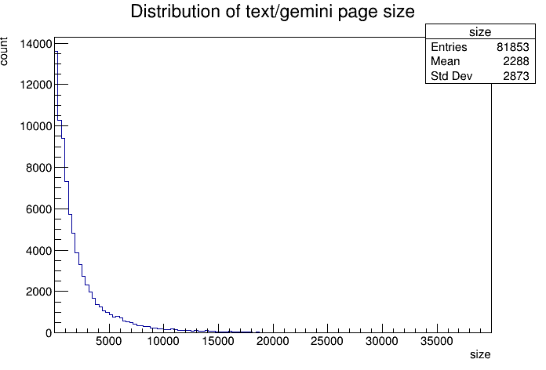
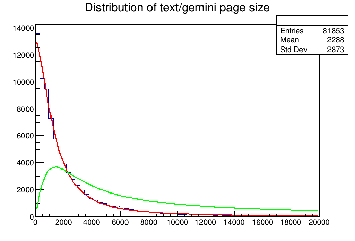
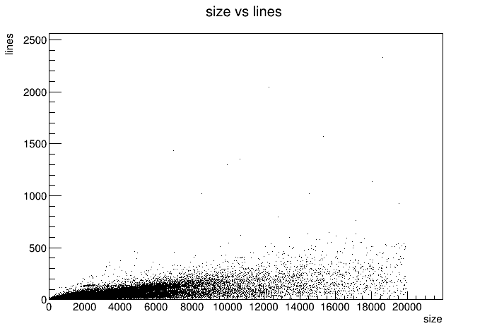
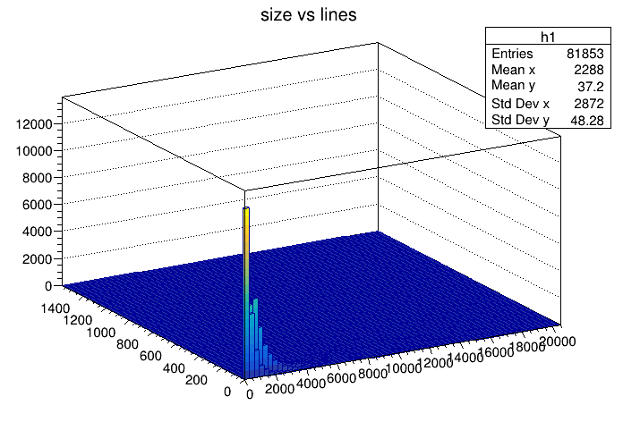
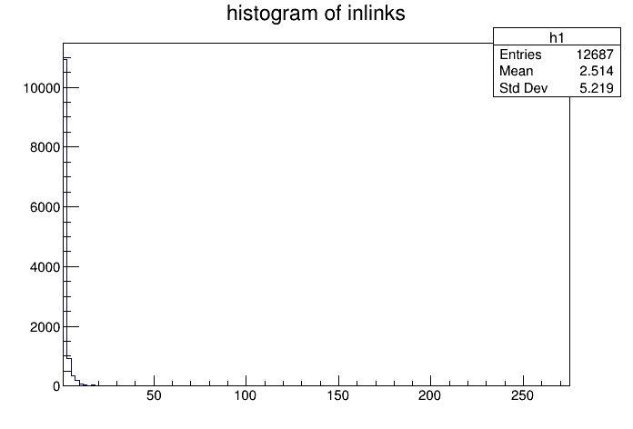

Lupa\[1] provides constant basic statistics about the Gemini network. Stats like how many servers are online, number of virtual hosts, TLS distribution, and so on. It's a really nice project. It got me asking.. what kinds of information can I extract from TLGS' index? Furthermore, I want to provide some more information for Gemini users. Helping us to understand the network we love.

It also helps me to build a better search engine. There's no hero here.

\[[1]: Lupa, a Gemini crawler](gemini://gemini.bortzmeyer.org/software/lupa/)

First things first, I decided to do analysis using CERN's ROOT data analysis framework\[2] instead of the more traditional Python + pandas. Foremost, I wanted to revist the framework because it helped me do some wicked things, like sorting through TBs of CSV and running an analysis on it. Without batching or ever running out of memory. Secondly, I intend (hopefully) to turn this project into an automated script and generate PDF as output. ROOT is sutable for this purpose as it can save plots as LaTeX.

ROOT is far from perfect. It's a bit rigid at times and the legacy interface is unpleasant. While the modern interface is not as featureful. I'll see what I can do.

\[[2]: ROOT: analyzing petabytes of data, scientifically.](<https://root.cern/>)

## [](https://github.com/ignaslaude/starter-hugo-academic/blob/main/content/post/some-boring-analysis-on-tlgs-index-and-messing-with-cerns-root-analysis-framework/index.md#getting-data-into-root)Getting data into ROOT

First, I need to get the index from PostgreSQL into SQLite. ROOT's RDataFrame should support PostgreSQL in the future. But for now, SQLite is the best option we have. The table format can be directly extracted from the source code of `tlgs_ctl` and use with minimal modification. Dumping the actual data is more complicated. What's generated by `pg_dump` is quite close to what SQLite can handle. But some changes are needed. I ended up creating my own command to remove unsupported commands. And generates "dump.sql" as output.

```
pg_dump --data-only --inserts tlgs | grep -v -e "\\(.setval\\|^SET\\)" |\
    sed "s/public\\.//g" | awk 'BEGIN {print "BEGIN;"} END{print "END;"} {print}' \
     > dump.sql
```

With the data ready. I can apply the tables in SQLite and import the data.

```sql
CREATE TABLE IF NOT EXISTS pages (
	url text NOT NULL,
	domain_name text NOT NULL,
	port integer NOT NULL,
	content_type text,
	charset text,
	lang text,
	title text,
	content_body text,
	size integer DEFAULT 0 NOT NULL,
	last_indexed_at timestamp without time zone,
	last_crawled_at timestamp without time zone,
	last_crawl_success_at timestamp without time zone,
	last_status integer,
	last_meta text,
	first_seen_at timestamp without time zone NOT NULL,
	search_vector tsvector,
	cross_site_links json,
	internal_links json,
	title_vector tsvector,
	last_queued_at timestamp without time zone,
	indexed_content_hash text NOT NULL default '',
	raw_content_hash text NOT NULL default '',
	PRIMARY KEY (url)
);

CREATE TABLE IF NOT EXISTS links (
	url text NOT NULL,
	host text NOT NULL,
	port integer NOT NULL,
	to_url text NOT NULL,
	to_host text NOT NULL,
	to_port integer NOT NULL,
	is_cross_site boolean NOT NULL
);

CREATE TABLE IF NOT EXISTS robot_policies (
	host text NOT NULL,
	port integer NOT NULL,
	disallowed text NOT NULL
);

CREATE TABLE IF NOT EXISTS robot_policies_status (
	host text NOT NULL,
	port integer NOT NULL,
	last_crawled_at timestamp without time zone NOT NULL,
	have_policy boolean NOT NULL,
	PRIMARY KEY (host, port)
);

.read dump.sql
```

The result is not perfect. Some syntax errors here and there. But most of the data arrived intact.

## [](https://github.com/ignaslaude/starter-hugo-academic/blob/main/content/post/some-boring-analysis-on-tlgs-index-and-messing-with-cerns-root-analysis-framework/index.md#the-boring-analysis)The boring analysis

Now we can start messing with ROOT. Nowadays, analysts are commonly asked to tell a story. I'll try that. As a developer, I want to know how large an average page is. Due to PostgreSQL's highlighting limitation. Currently highlighting is limited to the first 5K characters. I surely hope pages are not too large. In code, I create a data frame with all `text/gemini` pages. Then create a histogram of the page sizes less than 20K. Draw it. Then print how many pages are not included in the histogram.

```
root [0] rdf = ROOT::RDF::MakeSqliteDataFrame("./sqlite.db"
    , "SELECT size FROM pages WHERE content_type = \"text/gemini\"");
root [1] f1 = rdf.Filter("size != 0 && size < 20*1000")
(ROOT::RDF::RInterface<ROOT::Detail::RDF::RJittedFilter, void> &) @0xffff950ef088

root [2] h1 = f1.Histo1D("size")
(ROOT::RDF::RResultPtr<TH1D> &) @0xffff950ef0f8

root [3] h1->SetTitle("Distribution of text/gemini page size")
root [4] h1->Draw()
Info in <TCanvas::MakeDefCanvas>:  created default TCanvas with name c1

root [5] c1->SaveAs("c1.png")
Info in <TCanvas::Print>: png file c1.png has been created

root [6] root [6] *rdf.Count() - *f1.Count()
(unsigned long long) 1550
```

In all of TLGS' index. There are only 1550 pages larger than 20K. And the distribution looks like the following. Nice! Looks like most pages are quite small. And 5K is a good cutoff.



One question one may ask. Larger files tend to contain more information. Which makes it easier to be searched. Could we compensate for this? Yes! The data looks log-normal. Seems the Landau distribution will work. Assuming the number of tokens is correlated to the size of the page. We can fit a curve to our distribution and then multiply that curve against a linear function to get the expected result distribution (pivoting off the mean). Let's try it.

```
root [7] h1->Fit("landau")
 FCN=617.185 FROM MIGRAD    STATUS=CONVERGED     177 CALLS         178 TOTAL
                     EDM=2.35903e-08    STRATEGY= 1      ERROR MATRIX ACCURATE 
  EXT PARAMETER                                   STEP         FIRST   
  NO.   NAME      VALUE            ERROR          SIZE      DERIVATIVE 
   1  Constant     7.21594e+04   8.50337e+02   3.07065e+00  -3.76367e-07
   2  MPV          9.61922e+01   1.82522e+01   7.72726e-02  -2.20279e-05
   3  Sigma        4.87176e+02   2.47542e+00   4.86057e-06  -3.43981e-01
(TFitResultPtr) <nullptr TFitResult>

root [9] sizeFunc = TF1("sizeFunc", "x/2288.0", 0, 20*1000)
(TF1 &) Name: sizeFunc Title: x/2288.0

root [10] fitFunc = *(h1->GetFunction("landau"))
(TF1 &) Name: landau Title: landau

root [11] correctedFunc = TF1("correctedFunc", "fitFunc(x)*sizeFunc(x)", 0, 20*1000)
(TF1 &) Name: landau Title: correctedFunc

root [12] correctedFunc.SetLineColor(3)
root [13] correctedFunc.Draw("SAME");
root [14] c1->SaveAs("corrected.png");
Info in <TCanvas::Print>: png file corrected.png has been created
```



I'm too lazy to add a legend to the plot. The red curve is the fitted distribution. And the green one is the "corrected" distribution. Now limiting the highlighting to the first 5K characters seems to not be a good idea after all. Seems to be much space to the right. Hmm... But how much? Well, we can ask ROOT to inspect the curve.

```
root [15] i1 = correctedFunc.Integral(0, 5000)
(double) 13513212.

root [16] i2 = correctedFunc.Integral(0, 20*1000)
(double) 26138316.

root [16] i1/i2
(double) 0.51698864
```

Given my assumptions are correct. Only 51% of the pages will have "correct" highlighting. How about 10K? `correctedFunc.Integral(0, 10000)/i2` prints `0.76409630`, or 76%. That's a good indication that I should up the limit a bit.

Now we know the distribution of sizes. I wish to know the distribution of file size vs the number of lines (remember Gemtext is a line-based language).

```
root [0] rdf = ROOT::RDF::MakeSqliteDataFrame("./sqlite.db"
    , "SELECT size, content_body FROM pages WHERE content_type = \"text/gemini\"");
root [1] f1 = rdf.Filter("size != 0 && size < 20*1000")
(ROOT::RDF::RInterface<ROOT::Detail::RDF::RJittedFilter, void> &) @0xffff950ef088

root [2] countOccur = [](const std::string &s) { return std::count(s.begin(), s.end(), '\n'); }
((lambda) &) @0xffffaa9e8018

root [3] f2 = f1.Define("lines", "countOccur(content_body)")
(ROOT::RDF::RInterface<ROOT::Detail::RDF::RJittedFilter, ROOT::RDF::RInterface<ROOT::Detail::RDF::RJittedFilter, void>::DS_t>) @0xaaaae2ef7b40

root [4] g1 = f2.Graph("size", "lines")
(ROOT::RDF::RResultPtr<TGraph> &) @0xffffae08d170

root [5] g1->Draw("ap")
Info in <TCanvas::MakeDefCanvas>:  created default TCanvas with name c1

root [6] c1->SaveAs("scatter.png")
Info in <TCanvas::Print>: png file scatter.png has been created
```



Underwhelming. Sure there's a trend of more equal larger file size. But there's no interesting trend. Unless you count files aiming to be 20K in size but only have a few lines. I guess no result is also a result. I guess that just means there are very different ways how people write on Gemini. Maybe this points to machine-generated content? Some long URL? Maybe worth investigating. But not today. Nevertheless, I want a histogram of the distribution.

```
root [7] h2 = f2.Histo2D({"h1", "size vs lines", 64, 0, 128, 128, 20000, 2500}, "size", "lines")
(ROOT::RDF::RResultPtr<TH2D> &) @0xffffae08d220

root [8]  h2->Draw("LEGO1")
root [9] c1->SaveAs("h2d.png")
Info in <TCanvas::Print>: png file h2d.png has been created
```



I should have gone with a histogram in the first place. It clearly shows the distribution - there's a lot of small files and some medium-sized files. Big ones are rare. I should have expected this. The 1st histogram already shows small file sizes.

Now finished with a single page. I want to look at the connection between pages. To be specific, what's the distribution of outward backlinks? The code for this will be a bit more complicated. And uses more memory. But should be fine.

```
root [0] rdf = ROOT::RDF::MakeSqliteDataFrame("./sqlite.db", "SELECT pages.url AS url FROM "
	"pages JOIN links ON pages.url=links.to_url WHERE links.is_cross_site = TRUE "
	"AND content_type = \"text/gemini\"")
(ROOT::RDataFrame &) A data frame associated to the data source "generic data source"

root [1] unordered_map<string, size_t> inlink_count
(std::unordered_map<std::string, size_t> &) {}

root [2] rdf.Foreach([](const std::string& url) {inlink_count[url]++;}, {"url"})
root [3] inlink_count.size()
(unsigned long) 12687

root [4] vector<float> counts
(std::vector<float> &) {}

root [5] for(auto& [_, v] : inlink_count) counts.push_back(v);
root [6] h1 = TH1F("h1", "histogram of inlinks", 128, *min_element(counts.begin(), counts.end()), *max_element(counts.begin(), counts.end()))
(TH1F &) Name: h1 Title: histogram of inlinks NbinsX: 128
root [7] for(auto v : counts) h1.Fill(v)
root [8] h1.Draw()
Info in <TCanvas::MakeDefCanvas>:  created default TCanvas with name c1
root [9] c1->SaveAs("inlink_hist.png")
Info in <TCanvas::Print>: png file inlink_hist.png has been created
```



Unsurprisingly, most pages that has a backlink have one (since pages with 0 backlinks will not register in our SQL query). I'm surprised that there aren't more pages with more backlinks. I assume sites like geminispace.info, medusae.space, and so on would have a lot of backlinks. I think the bin does not overlap thus not showing up in a histogram. Surprisingly, there aren't much cross-capsule backlinks. 12687 is the total on the entire index. That's too low considering the amount of work people put into their content and aggregators generating backlinks.

I noticed I should have generated the backlink count per site directly in SQL. Welp.

Finally, I want to know how compressible Gemini content is and by extension, how large the content indexed. TLGS removes ASCII arts and other unnecessary text before indexing. Thus the indexed size is different than the original size. But how do we check the compression ratio? Importing zlib and using it would be too complicated. Instead, ROOT has it's own data archive format with the `.root` extension. It applies LZ4 compression to all stored data. Which we could use as an upper bound for the compression ratio (Since it has to store other metadata).

```
root [0] rdf = ROOT::RDF::MakeSqliteDataFrame("./sqlite.db", 
	"SELECT size, content_body FROM pages WHERE content_type = \"text/gemini\"");
(ROOT::RDataFrame &) A data frame associated to the data source "generic data source"

root [7] original_size = *rdf.Sum("size")
(double) 5.3742992e+08

root [8] indexed_size = *rdf.Define("indexed_size"
	, [](const string& s) {return s.size();}, {"content_body"}).Sum("indexed_size")
(double) 2.3638077e+08

root [10] rdf.Snapshot("content", "content.root", {"content_body"})
(ROOT::RDF::RResultPtr<ROOT::RDF::RInterface<ROOT::RDF::RInterface<ROOT::Detail::RDF::RLoopManager,
void>::RLoopManager> >) @0xaaaaeabc1a90

root [11] .! ls -lh content.root
-rw-r--r-- 1 marty marty 97M Jul 29 12:51 content.root
```

I'm (again) surprised how small Gemini is. Only 537MB of text is in my index. Moreover, only 236MB after removing ASCII art. More than a 50% reduction. Wow. The ~41% compression ratio upper bound looks about right. The typical ratio we'd expect to pure text.

## [](https://github.com/ignaslaude/starter-hugo-academic/blob/main/content/post/some-boring-analysis-on-tlgs-index-and-messing-with-cerns-root-analysis-framework/index.md#conclusion)Conclusion

Few things learned from this project.

* I might want to increase the limit of text highlighting to 10K.
* Some large files have very few lines
* There're a lot of small files. But not really searchable by search engine
* Gemini is short on backlinks

That's all. I'm out.